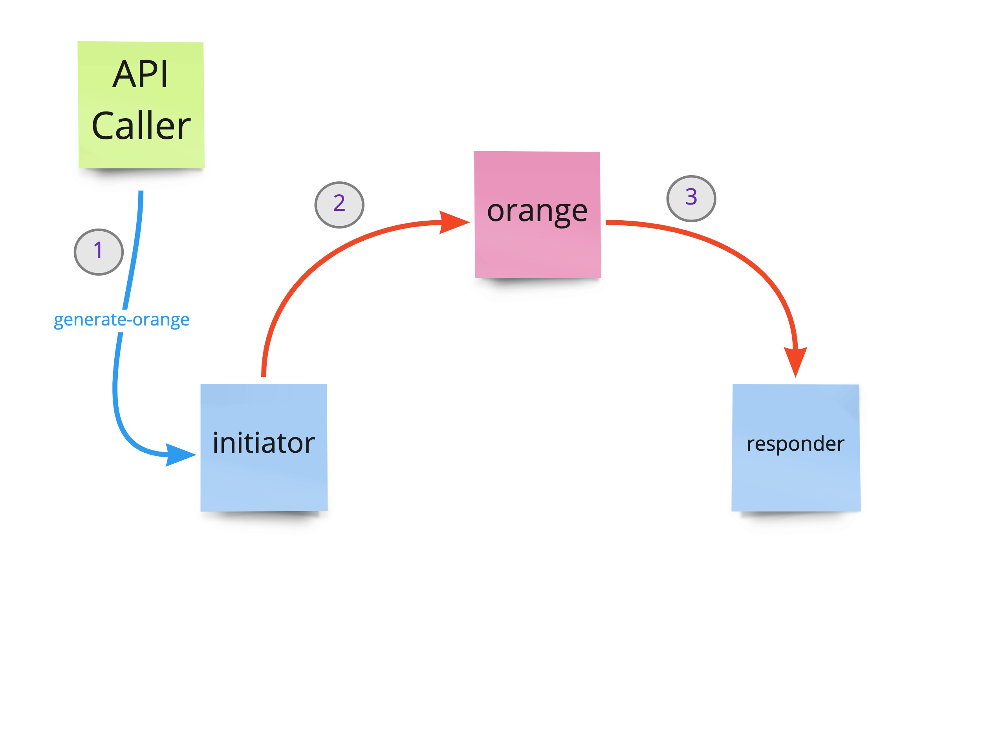
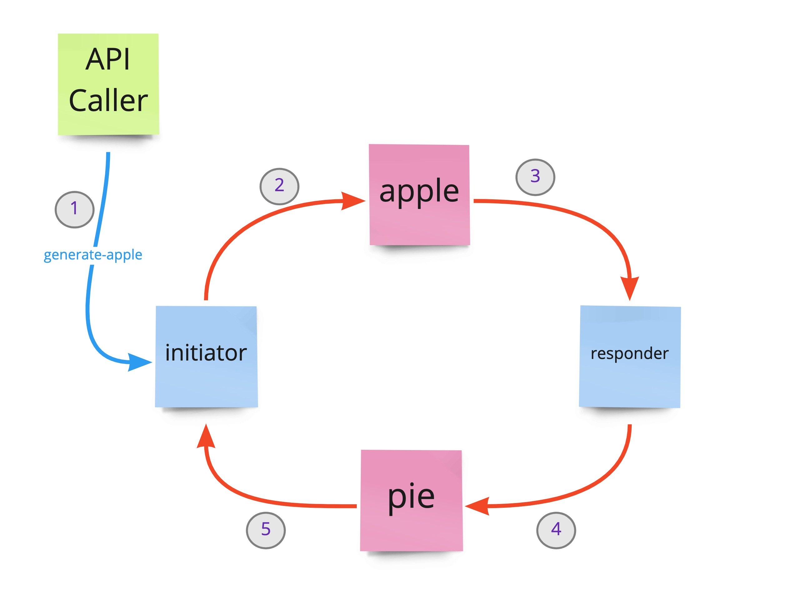

# spring-cloud-stream-sample

A sample set of spring-boot applications that use spring-cloud-stream to exchange some messages

There are two components in this system, the `initiator` and `responder`. Initiator listens on a port for *POST* calls and generates events. The `responder` only listens and generates events, it doesn't have an API.


## 1. Building

Both components are built and run similarly, they are both gradle projects.

```
./gradlew clean build
```

## 2. Running

```
java -jar build/libs/{APPNAME}-1.0.jar
```

where *APPNAME* is either `initiator` or `responder`

## 3. Running pre-requisites

These sample applications need a running instance of RabbitMQ or Kafka to function. Since the components use spring-cloud-stream abstraction, it can potentially work with any of the spring-cloud-stream 'binders' but was only tested with RabbitMQ and Kafka. You have to pick the same messaging technology for both components - these project don't show how to mix and match multiple messaging technologies in the same application but that is entirely possible.

### 3.1 Running with RabbitMQ (in docker)

The following command will start RabbitMQ running on port 5672 with the admin console available at [http://localhost:15672](http://localhost:15672)

```
docker run --rm -d -p 5672:5672 -p 15672:15672 rabbitmq:3-management
```

The username/password to access this RabbitMQ dashboard instance would be `guest`/`guest`

### 3.2 Running with Kafka (in docker)

The following command will start Kafka/Zookeeper running on ports 9092 (kafka) and 2181 (zookeeper). When running this way, start the applications with `kafka` spring profile (default profile will assume RabbitMQ). Since version 3.2.0 of the image, there is now a UI for the kafka broker available on port 8080 in the continer, but we will expose it on port 9090 so it doesn't interefere with our `initiator` application - access it using [http://localhost:9090](http://localhost:9090). In the command bellow, replace `{{{YOUR_HOSTNAME_HERE}}}` with either your computer's hostname or IP address.

```
docker run --rm -d -p 9090:8080 -p 2181:2181 -p 9092:9092 -e ENABLE_KAFKA_UI=true -e ADVERTISED_HOST={{{YOUR_HOSTNAME_HERE}}} maliksalman/kafka-dev:3.2.0
```

## 4. Kind of events

There are 3 kinds of events that flow through this system:

| Event Type | Producer Component | Consumer Component | Notes |
| ---------- | -------- | -------- | ----- |
| `orange` | `initiator` | `responder` | Generate this event through `POST /generate/orange` in the initiator component |
| `apple` | `initiator` | `responder` | Generate this event through the `POST /generate/apple` in the initiator component |
| `pie` | `responder` | `initiator` | The responder generates this event upon receiving the *apple* event |

### 4.1 `orange` message flow:



### 4.2 `apple` and `pie` messages flow:



